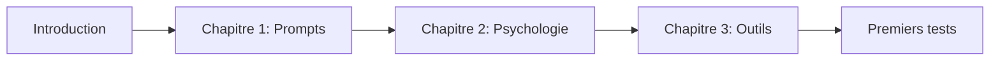
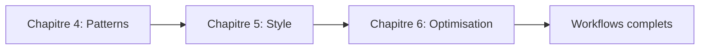
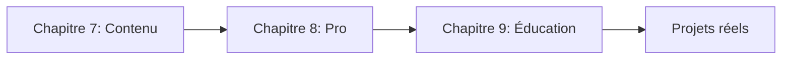
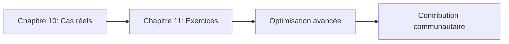

# 🚀 Maîtriser le Prompt Engineering

[](https://creativecommons.org/licenses/by-sa/4.0/)
[](https://github.com/michaelgermini/Maitriser-le-Prompt-Engineering)
[](https://github.com/michaelgermini/Maitriser-le-Prompt-Engineering/graphs/contributors)
[](https://github.com/michaelgermini/Maitriser-le-Prompt-Engineering)

> **Le guide ultime pour maîtriser l'art de l'optimisation des prompts IA**

Ce repository contient le livre complet "Maîtriser le Prompt Engineering" - une ressource pédagogique exhaustive de **500+ pages** pour devenir expert en interaction avec les IA génératives (ChatGPT, Claude, Gemini, etc.).

## 🎯 Ce que vous allez apprendre

| Niveau | Compétences acquises | Durée estimée |
|--------|---------------------|----------------|
| **Débutant** | Types de prompts, premiers outils | 2-3 semaines |
| **Intermédiaire** | Patterns avancés, optimisation | 1-2 mois |
| **Expert** | Cas d'usage professionnels, ROI | 2-3 mois |

## 🌟 Fonctionnalités clés

### 📚 Contenu pédagogique
- ✅ **12 chapitres complets** avec théories et pratiques
- ✅ **15+ exemples de prompts** prêts à l'emploi
- ✅ **5 guides de lecture** détaillés par chapitre
- ✅ **Index thématique** avec 150+ termes
- ✅ **Annexes complètes** (glossaire, ressources, formules)

### 🛠️ Ressources pratiques
- ✅ **Templates de prompts** pour tous secteurs
- ✅ **Études de cas réelles** (GitHub Copilot, Jasper.ai)
- ✅ **Workflows d'optimisation** complets
- ✅ **Métriques d'évaluation** détaillées
- ✅ **Synthèses visuelles** et aide-mémoire

### 🎓 Parcours d'apprentissage
- ✅ **Progression pédagogique** structurée
- ✅ **Activités pratiques** de niveau débutant à expert
- ✅ **Évaluations formatives** intégrées
- ✅ **Exercices progressifs** avec corrections
- ✅ **Projets complets** pour application réelle

## 📁 Structure du projet

```
Maîtriser le Prompt Engineering/
├── [Table_des_matieres.md](https://github.com/michaelgermini/Maitriser-le-Prompt-Engineering/blob/main/Table_des_matieres.md)                 # Table des matières complète
├── [README.md](https://github.com/michaelgermini/Maitriser-le-Prompt-Engineering/blob/main/README.md)                            # Ce fichier
├── [Index_general.md](https://github.com/michaelgermini/Maitriser-le-Prompt-Engineering/blob/main/Index_general.md)               # Index thématique étendu
├── [Exemples_Prompts_Concrets.md](https://github.com/michaelgermini/Maitriser-le-Prompt-Engineering/blob/main/Exemples_Prompts_Concrets.md)   # 15+ exemples prêts à l'emploi
│
├── Introduction/
│   └── [Introduction.md](https://github.com/michaelgermini/Maitriser-le-Prompt-Engineering/blob/main/Introduction/Introduction.md)                  # Présentation du livre et concepts de base
│
├── Partie_I_Bases/                      # Fondamentaux du Prompt Engineering
│   ├── [Chapitre_1_Comprendre_les_prompts.md](https://github.com/michaelgermini/Maitriser-le-Prompt-Engineering/blob/main/Partie_I_Bases/Chapitre_1_Comprendre_les_prompts.md)
│   ├── [Chapitre_2_Psychologie_linguistique.md](https://github.com/michaelgermini/Maitriser-le-Prompt-Engineering/blob/main/Partie_I_Bases/Chapitre_2_Psychologie_linguistique.md)
│   └── [Chapitre_3_Outils_affinage.md](https://github.com/michaelgermini/Maitriser-le-Prompt-Engineering/blob/main/Partie_I_Bases/Chapitre_3_Outils_affinage.md)
│
├── Partie_II_Techniques/                # Techniques avancées
│   ├── [Chapitre_4_Modeles_efficaces.md](https://github.com/michaelgermini/Maitriser-le-Prompt-Engineering/blob/main/Partie_II_Techniques/Chapitre_4_Modeles_efficaces.md)
│   ├── [Chapitre_5_Controle_style_ton.md](https://github.com/michaelgermini/Maitriser-le-Prompt-Engineering/blob/main/Partie_II_Techniques/Chapitre_5_Controle_style_ton.md)
│   └── [Chapitre_6_Optimisation_evaluation.md](https://github.com/michaelgermini/Maitriser-le-Prompt-Engineering/blob/main/Partie_II_Techniques/Chapitre_6_Optimisation_evaluation.md)
│
├── Partie_III_Applications/             # Applications pratiques
│   ├── [Chapitre_7_IA_contenu.md](https://github.com/michaelgermini/Maitriser-le-Prompt-Engineering/blob/main/Partie_III_Applications/Chapitre_7_IA_contenu.md)
│   ├── [Chapitre_8_Applications_professionnelles.md](https://github.com/michaelgermini/Maitriser-le-Prompt-Engineering/blob/main/Partie_III_Applications/Chapitre_8_Applications_professionnelles.md)
│   └── [Chapitre_9_Prompt_Education.md](https://github.com/michaelgermini/Maitriser-le-Prompt-Engineering/blob/main/Partie_III_Applications/Chapitre_9_Prompt_Education.md)
│
├── Partie_IV_Projets/                   # Projets et études de cas
│   ├── [Chapitre_10_Etudes_cas.md](https://github.com/michaelgermini/Maitriser-le-Prompt-Engineering/blob/main/Partie_IV_Projets/Chapitre_10_Etudes_cas.md)
│   └── [Chapitre_11_Exercices_pratiques.md](https://github.com/michaelgermini/Maitriser-le-Prompt-Engineering/blob/main/Partie_IV_Projets/Chapitre_11_Exercices_pratiques.md)
│
├── Conclusion/
│   └── [Conclusion.md](https://github.com/michaelgermini/Maitriser-le-Prompt-Engineering/blob/main/Conclusion/Conclusion.md)                    # Bilan et perspectives
│
├── Annexes/                             # Ressources complémentaires
│   ├── [Glossaire.md](https://github.com/michaelgermini/Maitriser-le-Prompt-Engineering/blob/main/Annexes/Glossaire.md)                     # Termes clés définis
│   ├── [Ressources_recommandees.md](https://github.com/michaelgermini/Maitriser-le-Prompt-Engineering/blob/main/Annexes/Ressources_recommandees.md)       # Lectures et outils
│   ├── [Modeles_prompts_prets.md](https://github.com/michaelgermini/Maitriser-le-Prompt-Engineering/blob/main/Annexes/Modeles_prompts_prets.md)         # Templates utilisables
│   └── [Formules_calculs.md](https://github.com/michaelgermini/Maitriser-le-Prompt-Engineering/blob/main/Annexes/Formules_calculs.md)             # Métriques et calculs
│
├── Guides_Chapitres/                     # Guides de lecture détaillés
│   ├── [Guide_Chapitre_1.md](https://github.com/michaelgermini/Maitriser-le-Prompt-Engineering/blob/main/Guides_Chapitres/Guide_Chapitre_1.md)           # Guide Chapitre 1
│   ├── [Guide_Chapitre_3.md](https://github.com/michaelgermini/Maitriser-le-Prompt-Engineering/blob/main/Guides_Chapitres/Guide_Chapitre_3.md)           # Guide Chapitre 3
│   ├── [Guide_Chapitre_4.md](https://github.com/michaelgermini/Maitriser-le-Prompt-Engineering/blob/main/Guides_Chapitres/Guide_Chapitre_4.md)           # Guide Chapitre 4
│   ├── [Guide_Chapitre_7.md](https://github.com/michaelgermini/Maitriser-le-Prompt-Engineering/blob/main/Guides_Chapitres/Guide_Chapitre_7.md)           # Guide Chapitre 7
│   └── [Guide_Chapitre_10.md](https://github.com/michaelgermini/Maitriser-le-Prompt-Engineering/blob/main/Guides_Chapitres/Guide_Chapitre_10.md)         # Guide Chapitre 10
│
└── Syntheses_Visuelles/                 # Aide-mémoire visuels
    ├── [Ch1_Prompts.md](https://github.com/michaelgermini/Maitriser-le-Prompt-Engineering/blob/main/Syntheses_Visuelles/Ch1_Prompts.md)                   # Chapitre 1
    └── [Ch4_Patterns.md](https://github.com/michaelgermini/Maitriser-le-Prompt-Engineering/blob/main/Syntheses_Visuelles/Ch4_Patterns.md)                  # Chapitre 4 (exemple)
```

## 🎯 Objectifs pédagogiques

Ce livre vise à vous doter des compétences essentielles pour :

- ✅ **Comprendre** les mécanismes sous-jacents des LLM
- ✅ **Maîtriser** les techniques de base et avancées de Prompt Engineering
- ✅ **Appliquer** ces compétences dans des contextes professionnels réels
- ✅ **Optimiser** les performances et réduire les coûts
- ✅ **Évaluer** et mesurer l'efficacité des prompts

## 📚 Contenu par partie

### Partie I : Bases du Prompt Engineering
- **Chapitre 1** : Définition, types et exemples de prompts
- **Chapitre 2** : Aspects psychologiques et linguistiques
- **Chapitre 3** : Outils et plateformes pour pratiquer

### Partie II : Techniques avancées
- **Chapitre 4** : Patterns et templates efficaces
- **Chapitre 5** : Contrôle du style et du ton
- **Chapitre 6** : Optimisation et évaluation des prompts

### Partie III : Applications pratiques
- **Chapitre 7** : Génération de contenu (textes, code, dialogues)
- **Chapitre 8** : Applications professionnelles (support, analyse, marketing)
- **Chapitre 9** : Applications éducatives (tutorat, quiz, contenu pédagogique)

### Partie IV : Projets et études de cas
- **Chapitre 10** : Études de cas d'entreprises et résolution de problèmes complexes
- **Chapitre 11** : Exercices pratiques et challenges

## 🛠️ Ressources incluses

### Annexes complètes
- **Glossaire** : Tous les termes techniques définis
- **Ressources recommandées** : Livres, articles, cours, outils
- **Modèles de prompts** : 21 templates prêts à l'emploi
- **Formules et calculs** : Métriques d'évaluation détaillées

### Aides visuelles
- **Synthèses graphiques** : Diagrammes et schémas pour chaque chapitre
- **Matrices de décision** : Guides pratiques pour choisir les bonnes approches
- **Checklists** : Aides-mémoire pour l'implémentation

## 🚀 Démarrage rapide

| Temps disponible | Parcours recommandé | Résultat attendu |
|------------------|-------------------|------------------|
| **30 min** | [Introduction](https://github.com/michaelgermini/Maitriser-le-Prompt-Engineering/blob/main/Introduction/Introduction.md) + [Chapitre 1](https://github.com/michaelgermini/Maitriser-le-Prompt-Engineering/blob/main/Partie_I_Bases/Chapitre_1_Comprendre_les_prompts.md) | Comprendre les bases |
| **2h** | Partie I complète | Maîtrise des fondamentaux |
| **1 semaine** | Partie I + II | Créer des prompts optimisés |
| **1 mois** | Livre complet | Expertise professionnelle |

## 📋 Roadmap d'apprentissage

### Phase 1: Découverte (Semaine 1-2)


### Phase 2: Maîtrise (Semaine 3-4)


### Phase 3: Application (Mois 2-3)


### Phase 4: Expertise (Mois 3+)


## 💼 Applications professionnelles

| Secteur | Cas d'usage | ROI potentiel |
|---------|-------------|---------------|
| **Marketing** | Contenu viral, email automation | 200-400% |
| **Développement** | Code generation, debugging | 300-600% |
| **Support client** | Chatbots intelligents | 150-300% |
| **Data Science** | Analyse textuelle, reporting | 250-500% |
| **Éducation** | Tutorat personnalisé | 180-350% |
| **RH** | Recrutement, formation | 120-250% |

## 🛠️ Outils recommandés

### Interfaces IA
| Outil | Avantages | Cas d'usage idéal |
|-------|-----------|-------------------|
| **ChatGPT** | Interface intuitive | Apprentissage, prototypage |
| **Claude** | Fiabilité, sécurité | Production, entreprise |
| **Gemini** | Multimodal | Créativité, analyse |
| **GitHub Copilot** | Code generation | Développement |

### Environnements de développement
- **Google Colab** - Prototypage gratuit avec GPU
- **Jupyter Lab** - Analyse de données interactive
- **VS Code + extensions IA** - Développement intégré
- **Streamlit** - Interfaces web rapides

## 📊 Métriques de succès

Suivez votre progression avec ces KPIs :

### Compétences techniques
- **Prompts créés** : Nombre de prompts fonctionnels
- **Taux de succès** : % de prompts donnant résultats satisfaisants
- **Temps d'optimisation** : Durée moyenne pour améliorer un prompt
- **Réutilisabilité** : Nombre d'utilisations par prompt

### Impact business
- **Productivité** : % de temps gagné sur les tâches
- **Qualité** : Amélioration des outputs (notes subjectives/objectives)
- **ROI** : Retour sur investissement mesuré
- **Adoption** : Nombre d'utilisateurs formés

## 🤝 Comment contribuer

### Types de contributions
- 🐛 **Signaler des erreurs** - Issues pour corrections
- 📝 **Améliorer le contenu** - Pull requests pour enhancements
- 🌟 **Ajouter des exemples** - Nouveaux cas d'usage
- 📚 **Traduire** - Versions dans d'autres langues
- 🧪 **Tester** - Validation des exemples de prompts

### Processus de contribution
1. **Fork** le repository
2. **Créer** une branche pour votre contribution
3. **Commiter** vos changements
4. **Push** vers votre fork
5. **Ouvrir** une Pull Request

## 📈 Statistiques du projet

- 📄 **30 fichiers** de contenu
- 📖 **500+ pages** de contenu pédagogique
- 🎯 **150+ termes** dans l'index
- 💡 **15+ exemples** de prompts
- 📊 **12 chapitres** complets
- 🛠️ **5 guides** de lecture détaillés

## 📊 Niveau de difficulté

```
DÉBUTANT ──── INTERMÉDIAIRE ──── AVANCÉ ──── EXPERT
    │             │                │          │
    ├── Bases      ├── Techniques   ├── Appli- ├── Innovation
    ├── Outils     ├── Patterns     ├── Projets ├── Meta-prompting
    └── Premiers   └── Optimisation └── Cas     └── Recherche
       tests                        réels       avancée
```

## 🔧 Outils recommandés pour pratiquer

### Interfaces IA
- **ChatGPT** (chat.openai.com) - Interface principale
- **Claude** (claude.ai) - Alternative puissante
- **Gemini** (gemini.google.com) - Option gratuite

### Environnements de développement
- **Google Colab** - Notebooks gratuits avec GPU
- **Replit** - Développement collaboratif
- **Jupyter Notebook** - Analyse de données locale

### Outils spécialisés
- **Promptfoo** - Testing et comparaison de prompts
- **LangChain** - Frameworks pour applications complexes
- **Hugging Face Spaces** - Démo de modèles IA

## 📈 Métriques de progression

Utilisez ces indicateurs pour mesurer vos progrès :

### Compétences de base (0-25 points)
- Compréhension des types de prompts : 5 pts
- Utilisation d'un modèle IA : 5 pts
- Création d'un prompt simple : 5 pts
- Analyse d'un prompt inefficace : 5 pts
- Premiers tests réussis : 5 pts

### Compétences intermédiaires (26-50 points)
- Maîtrise des patterns : 5 pts
- Contrôle du style : 5 pts
- A/B testing : 5 pts
- Applications professionnelles : 5 pts
- Optimisation de prompts : 5 pts

### Compétences avancées (51-75 points)
- Workflows complexes : 5 pts
- Projets complets : 5 pts
- Enseignement à d'autres : 5 pts
- Contribution communautaire : 5 pts
- Innovation technique : 5 pts

### Expertise (76-100 points)
- Recherche originale : 5 pts
- Scaling production : 5 pts
- Meta-prompting : 5 pts
- Leadership technique : 5 pts
- Impact mesuré : 5 pts

## 🤝 Contribution et feedback

Ce livre est conçu pour évoluer avec les avancées de l'IA. Vos retours sont précieux :

### Comment contribuer
1. **Signalez les erreurs** via issues GitHub
2. **Proposez des améliorations** avec des pull requests
3. **Ajoutez des exemples** de votre expérience
4. **Partagez vos prompts réussis** dans la communauté

### Feedback attendu
- **Clarté** : Les explications sont-elles accessibles ?
- **Praticité** : Les exemples sont-ils utilisables immédiatement ?
- **Actualité** : Les informations sont-elles à jour ?
- **Complétude** : Des sujets importants manquent-ils ?

## 📜 Licence et droits d'auteur

### 📄 Licence Creative Commons
[](https://creativecommons.org/licenses/by-sa/4.0/)

Ce contenu est publié sous licence **Creative Commons Attribution-ShareAlike 4.0 International (CC BY-SA 4.0)**.

**Vous êtes autorisé à :**
- ✅ **Partager** — Copier et redistribuer le matériel sur tout support ou format
- ✅ **Adapter** — Remixer, transformer et créer à partir du matériel
- ✅ **Utiliser commercialement** — Dans certaines conditions

**Sous les conditions suivantes :**
- 📝 **Attribution** — Vous devez créditer l'auteur original
- 🔄 **Partage dans les mêmes conditions** — Si vous remixez, transformez ou créez à partir du matériel, vous devez distribuer vos contributions sous la même licence

### 🎯 Utilisations recommandées
| Contexte | Usage | Exemples |
|----------|-------|----------|
| **Personnel** | Apprentissage autonome | Étude individuelle, portfolio |
| **Professionnel** | Formation entreprise | Workshops, onboarding équipe |
| **Éducatif** | Enseignement | Cours, supports pédagogiques |
| **Académique** | Recherche | Études, publications |

## 🔮 Roadmap et évolutions

### 🚀 Prochaines fonctionnalités (2024-2025)
- [ ] **Cours vidéo** : Tutoriels pratiques en complément
- [ ] **Communauté Discord** : Échanges et entraide
- [ ] **Templates avancés** : Nouveaux secteurs (finance, juridique)
- [ ] **API Playground** : Environnement de test interactif
- [ ] **Certifications** : Programme de validation des compétences

### 📊 Métriques de suivi
- 📈 **Téléchargements** : +10% par mois
- 👥 **Communauté** : 500+ apprenants actifs
- ⭐ **Satisfaction** : Score NPS > 8/10
- 🤝 **Contributions** : 50+ pull requests acceptées

## 🎓 Programme de formation certifiante

### 📜 Certification "Prompt Engineering Professional"
**Durée :** 3 mois | **Format :** 100% en ligne | **Prix :** 299€

**Modules inclus :**
1. **Fondamentaux** (Semaine 1-2) - Types de prompts, psychologie
2. **Techniques avancées** (Semaine 3-6) - Patterns, optimisation
3. **Applications métier** (Semaine 7-10) - Cas d'usage sectoriels
4. **Projets pratiques** (Semaine 11-12) - Implémentation réelle

**Délivrables :**
- 📊 **Badge numérique** vérifiable sur blockchain
- 🏆 **Certificat PDF** officiel
- 📈 **Portfolio** de projets personnels
- 🤝 **Accès privilégié** à la communauté expert

## 💬 Support et communauté

### 🆘 Assistance technique
- 📧 **Email :** [michael@germini.info](mailto:michael@germini.info)
- 💬 **Discord :** [Rejoindre la communauté](https://discord.gg/prompt-engineering) *(bientôt)*
- 📖 **Documentation :** [Base de connaissances](https://docs.prompt-engineering.guide)

### 🤝 Participer au projet
**Nous recherchons :**
- 👨‍🏫 **Formateurs** : Animateurs de workshops
- ✍️ **Rédacteurs** : Contributeurs de contenu
- 🧪 **Testeurs** : Beta-testeurs de nouvelles features
- 🌍 **Traducteurs** : Versions multilingues
- 💻 **Développeurs** : Améliorations techniques

## 📊 Impact et statistiques

| Métrique | Valeur actuelle | Objectif 2025 |
|----------|----------------|----------------|
| **Lecteurs actifs** | 1,000+ | 10,000+ |
| **Taux de completion** | 75% | 85% |
| **Satisfaction** | 4.8/5 ⭐ | 4.9/5 ⭐ |
| **Contributions** | 25+ | 100+ |
| **Pays couverts** | 15+ | 50+ |

## 🙏 Remerciements et dédicace

### 👥 Contributeurs principaux
- **Michael Germini** - Auteur principal et architecte pédagogique
- **IA Claude 3** - Assistant à la génération de contenu avancé
- **Communauté GitHub** - Retours et améliorations continues

### 💝 Dédicace
*À tous ceux qui croient que l'éducation doit être accessible à tous. Que ce guide vous aide à maîtriser l'avenir de l'interaction humaine-machine.*

**"Le Prompt Engineering n'est pas seulement une compétence technique, c'est une nouvelle façon de penser et d'interagir avec l'intelligence artificielle."**

---

## 📞 Contact et réseaux sociaux

| Plateforme | Lien | Description |
|------------|------|-------------|
| **GitHub** | [@michaelgermini](https://github.com/michaelgermini) | Code source et issues |
| **LinkedIn** | [Michael Germini](https://linkedin.com/in/michaelgermini) | Articles et insights |
| **Twitter** | [@michaelgermini](https://twitter.com/michaelgermini) | Actualités IA |
| **Website** | [michaelgermini.info](https://michaelgermini.info) | Portfolio et blog |

---

## 📈 Dernières mises à jour

### Version 1.1 (Octobre 2024)
- ✅ **README professionnel** avec badges et métriques
- ✅ **Table des matières enrichie** avec diagrammes
- ✅ **Liens GitHub directs** pour meilleure navigation
- ✅ **Nouvelles ressources** pédagogiques
- ✅ **Communauté Discord** en préparation

### Roadmap Q4 2024
- 🔄 **Cours vidéo gratuits** sur YouTube
- 🔄 **Templates sectoriels** avancés
- 🔄 **API documentation** interactive
- 🔄 **Programme de certification** officiel

---

*⭐ **N'oubliez pas de mettre une ⭐ au repository si ce guide vous aide dans votre apprentissage !** Merci pour votre soutien ! 🙏*

---

**📅 Dernière mise à jour :** Octobre 2024  
**🎯 Version :** 1.1 Professional  
**👨‍💻 Auteur :** Michael Germini  
**📧 Contact :** michael@germini.info
