# 🚀 Maîtriser le Prompt Engineering

[](https://creativecommons.org/licenses/by-sa/4.0/)
[](https://github.com/michaelgermini/Maitriser-le-Prompt-Engineering)
[](https://github.com/michaelgermini/Maitriser-le-Prompt-Engineering/graphs/contributors)
[](https://github.com/michaelgermini/Maitriser-le-Prompt-Engineering)

> **Le guide ultime pour maîtriser l'art de l'optimisation des prompts IA**

Ce repository contient le livre complet "Maîtriser le Prompt Engineering" - une ressource pédagogique exhaustive de **500+ pages** pour devenir expert en interaction avec les IA génératives (ChatGPT, Claude, Gemini, etc.).

## 🎯 Ce que vous allez apprendre

| Niveau | Compétences acquises | Durée estimée |
|--------|---------------------|----------------|
| **Débutant** | Types de prompts, premiers outils | 2-3 semaines |
| **Intermédiaire** | Patterns avancés, optimisation | 1-2 mois |
| **Expert** | Cas d'usage professionnels, ROI | 2-3 mois |

## 🌟 Fonctionnalités clés

### 📚 Contenu pédagogique
- ✅ **12 chapitres complets** avec théories et pratiques
- ✅ **15+ exemples de prompts** prêts à l'emploi
- ✅ **5 guides de lecture** détaillés par chapitre
- ✅ **Index thématique** avec 150+ termes
- ✅ **Annexes complètes** (glossaire, ressources, formules)

### 🛠️ Ressources pratiques
- ✅ **Templates de prompts** pour tous secteurs
- ✅ **Études de cas réelles** (GitHub Copilot, Jasper.ai)
- ✅ **Workflows d'optimisation** complets
- ✅ **Métriques d'évaluation** détaillées
- ✅ **Synthèses visuelles** et aide-mémoire

### 🎓 Parcours d'apprentissage
- ✅ **Progression pédagogique** structurée
- ✅ **Activités pratiques** de niveau débutant à expert
- ✅ **Évaluations formatives** intégrées
- ✅ **Exercices progressifs** avec corrections
- ✅ **Projets complets** pour application réelle

---

## 📊 Vue d'ensemble par catégorie

| 📂 **Catégorie** | 📄 **Fichiers** | 📏 **Taille** | 🎯 **Objectif** |
|------------------|----------------|---------------|-----------------|
| **Navigation** | 4 fichiers | ~100KB | Orientation & recherche |
| **Contenu principal** | 13 chapitres | ~800KB | Apprentissage progressif |
| **Guides pédagogiques** | 5 guides | ~150KB | Aide à la lecture |
| **Annexes** | 4 fichiers | ~200KB | Référence & approfondissement |
| **Visuels** | 2 fichiers | ~50KB | Aide-mémoire |

**Total : 30 fichiers • 1.3MB • 500+ pages de contenu pédagogique**

---

## 🗂️ Organisation logique du contenu

### 1️⃣ **Phase Découverte** (Navigation & Index)
- **README** : Accueil et présentation professionnelle
- **Table des matières** : Vue d'ensemble structurée
- **Index général** : Recherche par concepts (150+ termes)
- **Exemples concrets** : Mise en pratique immédiate

### 2️⃣ **Phase Apprentissage** (Contenu pédagogique)
- **Introduction** : Contexte et enjeux du Prompt Engineering
- **Partie I** : Bases fondamentales (types, psychologie, outils)
- **Partie II** : Techniques avancées (patterns, optimisation)
- **Partie III** : Applications pratiques (contenu, métier, éducation)
- **Partie IV** : Expertise (cas réels, projets complexes)

### 3️⃣ **Phase Pratique** (Ressources pédagogiques)
- **Guides de chapitres** : Aide détaillée par section
- **Synthèses visuelles** : Aide-mémoire graphiques
- **Annexes** : Références complètes (glossaire, templates, formules)

### 4️⃣ **Phase Référence** (Annexes & compléments)
- **Glossaire** : Tous les termes techniques définis
- **Ressources** : Lectures, outils, communautés
- **Templates** : Modèles prêts à utiliser
- **Calculs** : Métriques et formules d'évaluation

## 🎯 Objectifs pédagogiques

Ce livre vise à vous doter des compétences essentielles pour :

- ✅ **Comprendre** les mécanismes sous-jacents des LLM
- ✅ **Maîtriser** les techniques de base et avancées de Prompt Engineering
- ✅ **Appliquer** ces compétences dans des contextes professionnels réels
- ✅ **Optimiser** les performances et réduire les coûts
- ✅ **Évaluer** et mesurer l'efficacité des prompts

## 📚 Contenu par partie

### Partie I : Bases du Prompt Engineering
- **Chapitre 1** : Définition, types et exemples de prompts
- **Chapitre 2** : Aspects psychologiques et linguistiques
- **Chapitre 3** : Outils et plateformes pour pratiquer

### Partie II : Techniques avancées
- **Chapitre 4** : Patterns et templates efficaces
- **Chapitre 5** : Contrôle du style et du ton
- **Chapitre 6** : Optimisation et évaluation des prompts

### Partie III : Applications pratiques
- **Chapitre 7** : Génération de contenu (textes, code, dialogues)
- **Chapitre 8** : Applications professionnelles (support, analyse, marketing)
- **Chapitre 9** : Applications éducatives (tutorat, quiz, contenu pédagogique)

### Partie IV : Projets et études de cas
- **Chapitre 10** : Études de cas d'entreprises et résolution de problèmes complexes
- **Chapitre 11** : Exercices pratiques et challenges

## 🛠️ Ressources incluses

### Annexes complètes
- **Glossaire** : Tous les termes techniques définis
- **Ressources recommandées** : Livres, articles, cours, outils
- **Modèles de prompts** : 21 templates prêts à l'emploi
- **Formules et calculs** : Métriques d'évaluation détaillées

### Aides visuelles
- **Synthèses graphiques** : Diagrammes et schémas pour chaque chapitre
- **Matrices de décision** : Guides pratiques pour choisir les bonnes approches
- **Checklists** : Aides-mémoire pour l'implémentation

## 🚀 Démarrage rapide

| Temps disponible | Parcours recommandé | Résultat attendu |
|------------------|-------------------|------------------|
| **30 min** | [Introduction](https://github.com/michaelgermini/Maitriser-le-Prompt-Engineering/blob/main/Introduction/Introduction.md) + [Chapitre 1](https://github.com/michaelgermini/Maitriser-le-Prompt-Engineering/blob/main/Partie_I_Bases/Chapitre_1_Comprendre_les_prompts.md) | Comprendre les bases |
| **2h** | Partie I complète | Maîtrise des fondamentaux |
| **1 semaine** | Partie I + II | Créer des prompts optimisés |
| **1 mois** | Livre complet | Expertise professionnelle |

## 📋 Roadmap d'apprentissage

### Phase 1: Découverte (Semaine 1-2)


### Phase 2: Maîtrise (Semaine 3-4)


### Phase 3: Application (Mois 2-3)

```mermaid
graph LR
    J[Chapitre 7: Contenu] --> K[Chapitre 8: Pro]
    K --> L[Chapitre 9: Éducation]
    L --> M[Projets réels]
```


### Phase 4: Expertise (Mois 3+)

```mermaid
graph LR
    N[Chapitre 10: Cas réels] --> O[Chapitre 11: Exercices]
    O --> P[Optimisation avancée]
    P --> Q[Contribution communautaire]
```


## 💼 Applications professionnelles

| Secteur | Cas d'usage | ROI potentiel |
|---------|-------------|---------------|
| **Marketing** | Contenu viral, email automation | 200-400% |
| **Développement** | Code generation, debugging | 300-600% |
| **Support client** | Chatbots intelligents | 150-300% |
| **Data Science** | Analyse textuelle, reporting | 250-500% |
| **Éducation** | Tutorat personnalisé | 180-350% |
| **RH** | Recrutement, formation | 120-250% |

## 🛠️ Outils recommandés

### Interfaces IA
| Outil | Avantages | Cas d'usage idéal |
|-------|-----------|-------------------|
| **ChatGPT** | Interface intuitive | Apprentissage, prototypage |
| **Claude** | Fiabilité, sécurité | Production, entreprise |
| **Gemini** | Multimodal | Créativité, analyse |
| **GitHub Copilot** | Code generation | Développement |

### Environnements de développement
- **Google Colab** - Prototypage gratuit avec GPU
- **Jupyter Lab** - Analyse de données interactive
- **VS Code + extensions IA** - Développement intégré
- **Streamlit** - Interfaces web rapides

## 📊 Métriques de succès

Suivez votre progression avec ces KPIs :

### Compétences techniques
- **Prompts créés** : Nombre de prompts fonctionnels
- **Taux de succès** : % de prompts donnant résultats satisfaisants
- **Temps d'optimisation** : Durée moyenne pour améliorer un prompt
- **Réutilisabilité** : Nombre d'utilisations par prompt

### Impact business
- **Productivité** : % de temps gagné sur les tâches
- **Qualité** : Amélioration des outputs (notes subjectives/objectives)
- **ROI** : Retour sur investissement mesuré
- **Adoption** : Nombre d'utilisateurs formés

## 🤝 Comment contribuer

### Types de contributions
- 🐛 **Signaler des erreurs** - Issues pour corrections
- 📝 **Améliorer le contenu** - Pull requests pour enhancements
- 🌟 **Ajouter des exemples** - Nouveaux cas d'usage
- 📚 **Traduire** - Versions dans d'autres langues
- 🧪 **Tester** - Validation des exemples de prompts

### Processus de contribution
1. **Fork** le repository
2. **Créer** une branche pour votre contribution
3. **Commiter** vos changements
4. **Push** vers votre fork
5. **Ouvrir** une Pull Request

## 📈 Statistiques du projet

- 📄 **30 fichiers** de contenu
- 📖 **500+ pages** de contenu pédagogique
- 🎯 **150+ termes** dans l'index
- 💡 **15+ exemples** de prompts
- 📊 **12 chapitres** complets
- 🛠️ **5 guides** de lecture détaillés

## 📊 Niveau de difficulté

```
DÉBUTANT ──── INTERMÉDIAIRE ──── AVANCÉ ──── EXPERT
    │             │                │          │
    ├── Bases      ├── Techniques   ├── Appli- ├── Innovation
    ├── Outils     ├── Patterns     ├── Projets ├── Meta-prompting
    └── Premiers   └── Optimisation └── Cas     └── Recherche
       tests                        réels       avancée
```

## 🔧 Outils recommandés pour pratiquer

### Interfaces IA
- **ChatGPT** (chat.openai.com) - Interface principale
- **Claude** (claude.ai) - Alternative puissante
- **Gemini** (gemini.google.com) - Option gratuite

### Environnements de développement
- **Google Colab** - Notebooks gratuits avec GPU
- **Replit** - Développement collaboratif
- **Jupyter Notebook** - Analyse de données locale

### Outils spécialisés
- **Promptfoo** - Testing et comparaison de prompts
- **LangChain** - Frameworks pour applications complexes
- **Hugging Face Spaces** - Démo de modèles IA

## 📈 Métriques de progression

Utilisez ces indicateurs pour mesurer vos progrès :

### Compétences de base (0-25 points)
- Compréhension des types de prompts : 5 pts
- Utilisation d'un modèle IA : 5 pts
- Création d'un prompt simple : 5 pts
- Analyse d'un prompt inefficace : 5 pts
- Premiers tests réussis : 5 pts

### Compétences intermédiaires (26-50 points)
- Maîtrise des patterns : 5 pts
- Contrôle du style : 5 pts
- A/B testing : 5 pts
- Applications professionnelles : 5 pts
- Optimisation de prompts : 5 pts

### Compétences avancées (51-75 points)
- Workflows complexes : 5 pts
- Projets complets : 5 pts
- Enseignement à d'autres : 5 pts
- Contribution communautaire : 5 pts
- Innovation technique : 5 pts

### Expertise (76-100 points)
- Recherche originale : 5 pts
- Scaling production : 5 pts
- Meta-prompting : 5 pts
- Leadership technique : 5 pts
- Impact mesuré : 5 pts

## 🤝 Contribution et feedback

Ce livre est conçu pour évoluer avec les avancées de l'IA. Vos retours sont précieux :

### Comment contribuer
1. **Signalez les erreurs** via issues GitHub
2. **Proposez des améliorations** avec des pull requests
3. **Ajoutez des exemples** de votre expérience
4. **Partagez vos prompts réussis** dans la communauté

### Feedback attendu
- **Clarté** : Les explications sont-elles accessibles ?
- **Praticité** : Les exemples sont-ils utilisables immédiatement ?
- **Actualité** : Les informations sont-elles à jour ?
- **Complétude** : Des sujets importants manquent-ils ?

## 📜 Licence et droits d'auteur

### 📄 Licence Creative Commons
[](https://creativecommons.org/licenses/by-sa/4.0/)

Ce contenu est publié sous licence **Creative Commons Attribution-ShareAlike 4.0 International (CC BY-SA 4.0)**.

### 💝 Dédicace
*À tous ceux qui croient que l'éducation doit être accessible à tous. Que ce guide vous aide à maîtriser l'avenir de l'interaction humaine-machine.*

**"Le Prompt Engineering n'est pas seulement une compétence technique, c'est une nouvelle façon de penser et d'interagir avec l'intelligence artificielle."**

---

## 📈 Dernières mises à jour

### Version 1.1 (Octobre 2024)
- ✅ **README professionnel** avec badges et métriques
- ✅ **Table des matières enrichie** avec diagrammes
- ✅ **Liens GitHub directs** pour meilleure navigation
- ✅ **Nouvelles ressources** pédagogiques
- ✅ **Communauté Discord** en préparation

### Roadmap Q4 2024
- 🔄 **Cours vidéo gratuits** sur YouTube
- 🔄 **Templates sectoriels** avancés
- 🔄 **API documentation** interactive
- 🔄 **Programme de certification** officiel

---

*⭐ **N'oubliez pas de mettre une ⭐ au repository si ce guide vous aide dans votre apprentissage !** Merci pour votre soutien ! 🙏*

---

**📅 Dernière mise à jour :** Octobre 2024  
**🎯 Version :** 1.1 Professional  
**👨‍💻 Auteur :** Michael Germini  
**📧 Contact :** michael@germini.info
