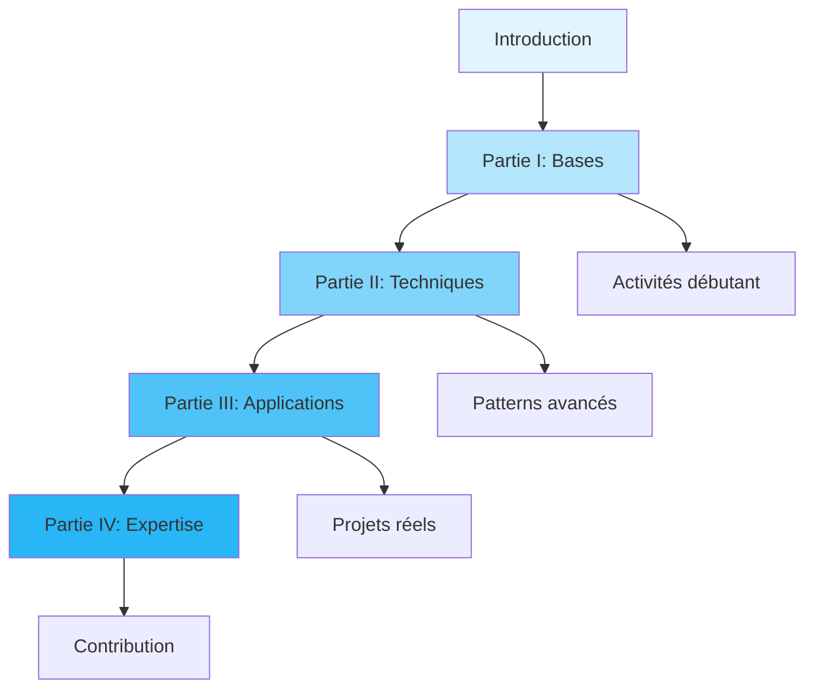

# 📚 Maîtriser le Prompt Engineering

> **Guide complet pour maîtriser l'art des prompts IA - De ChatGPT à Claude en passant par Gemini**

---

## 🎯 Vue d'ensemble du livre

| 📊 **Statistiques** | 📖 **Contenu** | 🎓 **Apprentissage** |
|-------------------|----------------|---------------------|
| **500+ pages** | **12 chapitres** | **4 niveaux** |
| **30 fichiers** | **15+ exemples** | **Progression structurée** |
| **150+ termes** | **5 guides détaillés** | **Activités pratiques** |

---

## 🗂️ Table des matières détaillée

### 📋 Navigation rapide
- 🔍 **[Index général](https://github.com/michaelgermini/Maitriser-le-Prompt-Engineering/blob/main/Index_general.md)** - Recherche thématique étendue (150+ termes)
- 💡 **[Exemples concrets](https://github.com/michaelgermini/Maitriser-le-Prompt-Engineering/blob/main/Exemples_Prompts_Concrets.md)** - 15+ prompts prêts à l'emploi
- 🛠️ **[Guides de chapitres](https://github.com/michaelgermini/Maitriser-le-Prompt-Engineering/tree/main/Guides_Chapitres)** - Aide à la lecture détaillée

---

### 📖 Introduction
| Chapitre | Titre | Durée | Objectif |
|----------|-------|-------|----------|
| **[Intro](https://github.com/michaelgermini/Maitriser-le-Prompt-Engineering/blob/main/Introduction/Introduction.md)** | Qu'est-ce que le Prompt Engineering ? | 30 min | Comprendre les enjeux |

**Contenu :**
- Histoire et évolution des IA génératives
- Pourquoi le Prompt Engineering est crucial
- Aperçu des grands modèles (GPT, Claude, Gemini)
- Objectifs et structure du livre

---

### 🎯 Partie I : Les Bases (2-3 semaines)

| Chapitre | Titre | Durée | Niveau | Guide |
|----------|-------|-------|--------|-------|
| **[1](https://github.com/michaelgermini/Maitriser-le-Prompt-Engineering/blob/main/Partie_I_Bases/Chapitre_1_Comprendre_les_prompts.md)** | Comprendre les prompts | 45 min | Débutant | [📖](https://github.com/michaelgermini/Maitriser-le-Prompt-Engineering/blob/main/Guides_Chapitres/Guide_Chapitre_1.md) |
| **[2](https://github.com/michaelgermini/Maitriser-le-Prompt-Engineering/blob/main/Partie_I_Bases/Chapitre_2_Psychologie_linguistique.md)** | Psychologie et linguistique | 1h | Débutant | - |
| **[3](https://github.com/michaelgermini/Maitriser-le-Prompt-Engineering/blob/main/Partie_I_Bases/Chapitre_3_Outils_affinage.md)** | Outils et plateformes | 2h | Débutant | [📖](https://github.com/michaelgermini/Maitriser-le-Prompt-Engineering/blob/main/Guides_Chapitres/Guide_Chapitre_3.md) |

**Compétences acquises :**
- ✅ Types de prompts (zéro-shot, few-shot, one-shot)
- ✅ Principes de clarté, concision, précision
- ✅ Maîtrise des interfaces IA (ChatGPT, Claude, Gemini)
- ✅ Premiers tests et évaluations

---

### 🚀 Partie II : Techniques Avancées (1-2 mois)

| Chapitre | Titre | Durée | Niveau | Guide | Visualisation |
|----------|-------|-------|--------|-------|---------------|
| **[4](https://github.com/michaelgermini/Maitriser-le-Prompt-Engineering/blob/main/Partie_II_Techniques/Chapitre_4_Modeles_efficaces.md)** | Patterns et templates | 2h | Intermédiaire | [📖](https://github.com/michaelgermini/Maitriser-le-Prompt-Engineering/blob/main/Guides_Chapitres/Guide_Chapitre_4.md) | [📊](https://github.com/michaelgermini/Maitriser-le-Prompt-Engineering/blob/main/Syntheses_Visuelles/Ch4_Patterns.md) |
| **[5](https://github.com/michaelgermini/Maitriser-le-Prompt-Engineering/blob/main/Partie_II_Techniques/Chapitre_5_Controle_style_ton.md)** | Contrôle du style et ton | 1.5h | Intermédiaire | - | - |
| **[6](https://github.com/michaelgermini/Maitriser-le-Prompt-Engineering/blob/main/Partie_II_Techniques/Chapitre_6_Optimisation_evaluation.md)** | Optimisation et évaluation | 2.5h | Intermédiaire | - | - |

**Patterns maîtrisés :**
- 🎯 **RAF** (Rôle-Action-Format)
- 🧠 **Chain of Thought** (CoT)
- 📝 **Templates à trous**
- 🎭 **Multi-perspective**
- 🔄 **Prompts itératifs**

---

### 💼 Partie III : Applications Pratiques (2-3 mois)

| Chapitre | Titre | Durée | Niveau | Guide | Applications |
|----------|-------|-------|--------|-------|--------------|
| **[7](https://github.com/michaelgermini/Maitriser-le-Prompt-Engineering/blob/main/Partie_III_Applications/Chapitre_7_IA_contenu.md)** | IA générative pour le contenu | 3h | Avancé | [📖](https://github.com/michaelgermini/Maitriser-le-Prompt-Engineering/blob/main/Guides_Chapitres/Guide_Chapitre_7.md) | ✍️ Écriture, 📝 Code, 💬 Chatbots |
| **[8](https://github.com/michaelgermini/Maitriser-le-Prompt-Engineering/blob/main/Partie_III_Applications/Chapitre_8_Applications_professionnelles.md)** | Applications professionnelles | 2.5h | Avancé | - | 🤖 Support, 📊 Data, 📢 Marketing |
| **[9](https://github.com/michaelgermini/Maitriser-le-Prompt-Engineering/blob/main/Partie_III_Applications/Chapitre_9_Prompt_Education.md)** | Prompt Engineering éducatif | 2h | Avancé | - | 👨‍🏫 Tutorat, 📝 Quiz, 📚 Contenu |

**Secteurs couverts :**
- 📱 **Tech** : Développement, debugging, architecture
- 🎨 **Créatif** : Marketing, contenu, storytelling
- 🏥 **Santé** : Diagnostic assisté, documentation
- 📚 **Éducation** : Apprentissage personnalisé
- 💼 **Business** : Analyse, stratégie, automatisation

---

### 🏆 Partie IV : Projets et Expertise (3+ mois)

| Chapitre | Titre | Durée | Niveau | Guide | Focus |
|----------|-------|-------|--------|-------|-------|
| **[10](https://github.com/michaelgermini/Maitriser-le-Prompt-Engineering/blob/main/Partie_IV_Projets/Chapitre_10_Etudes_cas.md)** | Études de cas réelles | 4h | Expert | [📖](https://github.com/michaelgermini/Maitriser-le-Prompt-Engineering/blob/main/Guides_Chapitres/Guide_Chapitre_10.md) | 🚀 GitHub Copilot, 🏢 Enterprise |
| **[11](https://github.com/michaelgermini/Maitriser-le-Prompt-Engineering/blob/main/Partie_IV_Projets/Chapitre_11_Exercices_pratiques.md)** | Exercices avancés | 5h | Expert | - | 🎯 Challenges, 🏗️ Projets |

**Études de cas détaillées :**
- 🔧 **GitHub Copilot** : Révolution du développement
- ✍️ **Jasper.ai** : Content marketing automation
- 🤖 **OpenAI Enterprise** : Optimisation à grande échelle

---

### 🎉 Conclusion
**[Conclusion](https://github.com/michaelgermini/Maitriser-le-Prompt-Engineering/blob/main/Conclusion/Conclusion.md)** - Bilan et perspectives futures

**Contenu :**
- 📈 Récapitulatif des compétences acquises
- 🔮 Évolutions futures des IA
- 📚 Ressources complémentaires
- 🎯 Prochaines étapes d'apprentissage

---

### 📚 Annexes et Ressources

| Ressource | Contenu | Utilité |
|-----------|---------|---------|
| **[Glossaire](https://github.com/michaelgermini/Maitriser-le-Prompt-Engineering/blob/main/Annexes/Glossaire.md)** | 150+ termes définis | 🔍 Référence rapide |
| **[Ressources](https://github.com/michaelgermini/Maitriser-le-Prompt-Engineering/blob/main/Annexes/Ressources_recommandees.md)** | Livres, cours, outils | 📖 Approfondissement |
| **[Templates](https://github.com/michaelgermini/Maitriser-le-Prompt-Engineering/blob/main/Annexes/Modeles_prompts_prets.md)** | 21 modèles utilisables | 🛠️ Production |
| **[Formules](https://github.com/michaelgermini/Maitriser-le-Prompt-Engineering/blob/main/Annexes/Formules_calculs.md)** | Métriques, calculs | 📊 Évaluation |

---

### 🧭 Ressources pédagogiques complémentaires

| Type | Ressource | Description |
|------|-----------|-------------|
| 📖 **Guides** | [5 guides détaillés](https://github.com/michaelgermini/Maitriser-le-Prompt-Engineering/tree/main/Guides_Chapitres) | Aide à la lecture chapitre par chapitre |
| 📊 **Visualisations** | [Synthèses graphiques](https://github.com/michaelgermini/Maitriser-le-Prompt-Engineering/tree/main/Syntheses_Visuelles) | Aide-mémoire et schémas |
| 💡 **Exemples** | [15+ prompts concrets](https://github.com/michaelgermini/Maitriser-le-Prompt-Engineering/blob/main/Exemples_Prompts_Concrets.md) | Templates prêts à l'emploi |
| 🔍 **Index** | [Recherche thématique](https://github.com/michaelgermini/Maitriser-le-Prompt-Engineering/blob/main/Index_general.md) | Navigation par concepts |

---

## 📈 Progression recommandée

---

## 🎯 Points de contrôle par niveau

### 🟢 Niveau Débutant (Semaines 1-3)
- [ ] Comprendre les types de prompts
- [ ] Maîtriser une interface IA
- [ ] Créer ses premiers prompts optimisés
- [ ] Évaluer la qualité des réponses

### 🟡 Niveau Intermédiaire (Semaines 4-8)
- [ ] Maîtriser les patterns avancés (RAF, CoT)
- [ ] Contrôler le style et le ton
- [ ] Mettre en place A/B testing
- [ ] Calculer le ROI des optimisations

### 🟠 Niveau Avancé (Mois 3-6)
- [ ] Générer du contenu professionnel
- [ ] Implémenter des applications IA
- [ ] Enseigner le Prompt Engineering
- [ ] Optimiser pour la production

### 🔴 Niveau Expert (Mois 6+)
- [ ] Analyser des cas d'entreprise complexes
- [ ] Développer des méthodologies innovantes
- [ ] Mesurer l'impact à l'échelle
- [ ] Contribuer à l'écosystème IA

---

## 📞 Support et communauté

- 🐛 **[Issues](https://github.com/michaelgermini/Maitriser-le-Prompt-Engineering/issues)** - Signaler des problèmes
- 💡 **[Discussions](https://github.com/michaelgermini/Maitriser-le-Prompt-Engineering/discussions)** - Échanger avec la communauté
- 🤝 **[Contribuer](https://github.com/michaelgermini/Maitriser-le-Prompt-Engineering/blob/main/CONTRIBUTING.md)** - Participer au projet

---

## 📄 Informations légales

**Licence :** [Creative Commons Attribution-ShareAlike 4.0](https://creativecommons.org/licenses/by-sa/4.0/)

**Auteur :** Michael Germini

**Dernière mise à jour :** Octobre 2024

---

*⭐ Si ce guide vous aide dans votre apprentissage du Prompt Engineering, n'hésitez pas à le mettre en favori et le partager !*
